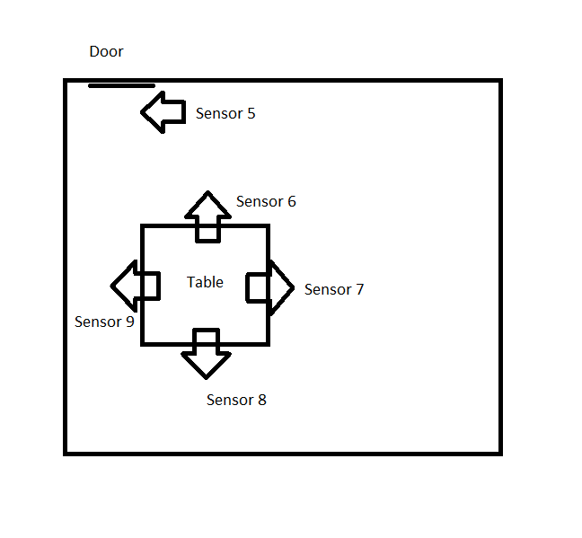

# How to Deploy

## Account Information

Google Account Username: cs4560test@gmail.com  
Google Account Password: @Progpals123

You can sign in to firebase with this account to view our user and room database. This account is currently set up with a paid plan which is necessary in order to have notification functionality. The cost is based on usage however so currently it is only costing us a couple cents per month I believe.

CloudFlare Account Username: cs4560test@gmail.com  
CloudFlare Account Password: @Progpals123

Our CloudFlare account is used for registering our domain [bobcatstudy.net](https://bobcatstudy.net/). Currently the domain will expire on March 15th, 2023. The cost to renew it is $9.95 per year.

Raspberry Pi Account Username: progpal  
Raspberry Pi Account Password: progpal2021

## How to install node.js
 
### Windows

Go to [this website](https://nodejs.org/en/download/), download the Window Installer and run it.

### Linux

Follow [this tutorial](https://ostechnix.com/install-node-js-linux/)

## How to build the website

1. Install node.js. See instructions above. 
2. Clone our repo
3. Navigate to the prog-paladins/office-availability directory
4. Run 'npm install' to get the necessary node modules
5. Run 'npm start', this will start a local instance of the website
6. Once you have confirmed the website is functioning properly, we can create the deployment build, but first you need to go to prog-paladins/office-availability/src/ouprovider.js, and edit line 63 to have this url "https://bobcatstudy.net/ouconfirm". 
7. Then run 'npm run build' to generate the release build which we will use for deployment.

## How to install Apache

We use Apache for hosting the server. We've been hosting it on a Windows machine so these instructions will be for creating an Apache server on Windows, but the setup should be very similar on Linux.

1. Go to [this website](https://www.apachehaus.com/cgi-bin/download.plx). Download the latest version.
2. Open the zip folder and follow the installation instructions found in the readme_first.html file
3. You have the option to install apache as a service or run it using the exe, I would recommend installing it as a service
4. Once the server is setup and installed, go to the htdocs folder, delete the index.html file, go back to the repo and go to prog-paladins/office-availability/build, copy everything in that folder over to the htdocs folder.
5. Copy prog-paladins/documentation/.htaccess file to the htdocs folder. This file is necessary to make navigate between pages work correctly.

## How to connect the URL to the server

1. Ensure that port 80 is port-forwarded.
2. Go to CloudFlare, go to the DNS tab, edit the entries for bobcatstudy.net and www with the IP address of your server.

## How to install sensors

This is an example of a good sensor setup for Arc 155:

The door sensor could be installed on either side of the door. Consult [this diagram](https://www.raspberrypi.com/documentation/computers/images/GPIO-Pinout-Diagram-2.png) to see which pins to connect the sensors to. The sensor should be connected to the appropriate GPIO pin, depending on the number seen in the Sensor Layout diagram, as well as power and ground.
